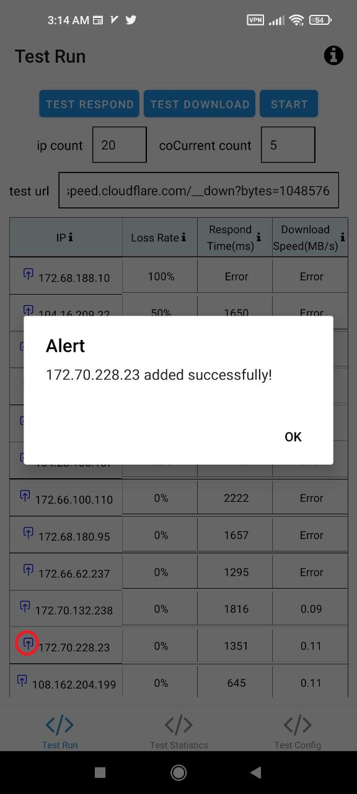
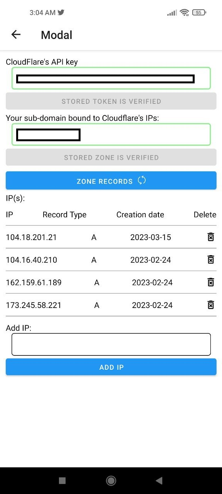

# cloudflare-ip-tester-app

[中文文档](./README.MD)

### Functions

- test cloudflare-ip as many as you want
- generate a history statistics based on your test results.

    
    

### Features of this fork
- Adding ip to your domain records directly from test pages
- View/Add/Delete ip records of your domain

    
    

### Inspired by

- [CloudflareSpeedTest](https://github.com/XIU2/CloudflareSpeedTest)
- [cloudflare-ip-tester](https://github.com/TulvL/cloudflare-ip-tester)

### Download App

[Pre-releases](https://github.com/lingwndr/cloudflare-ip-tester-app/releases)

### MIT License
